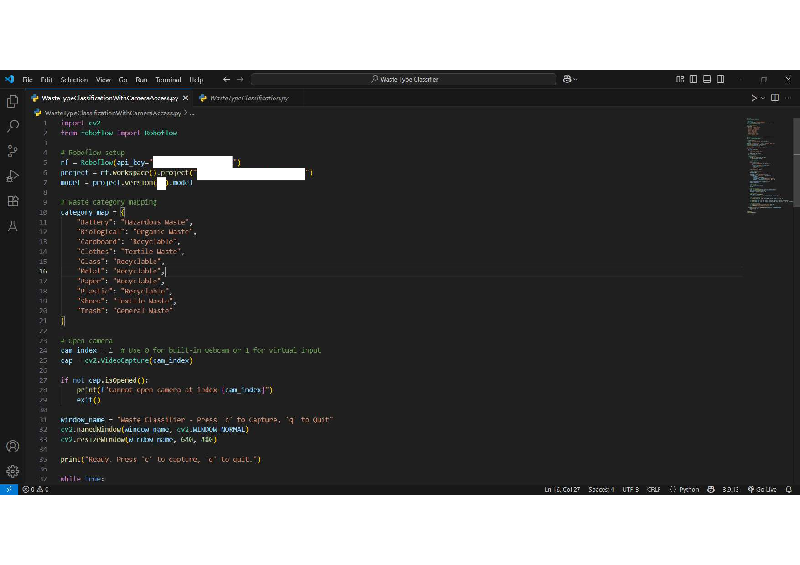
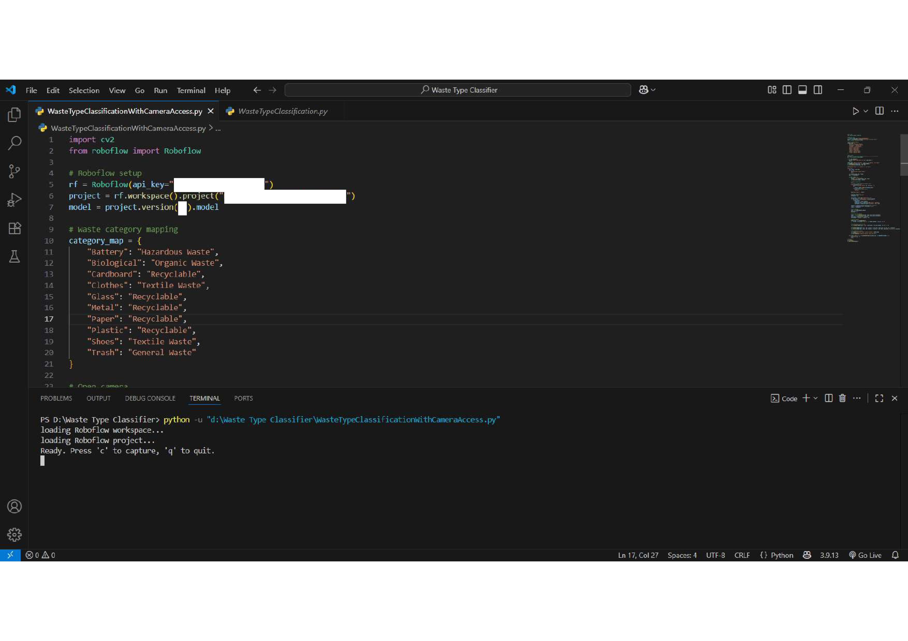
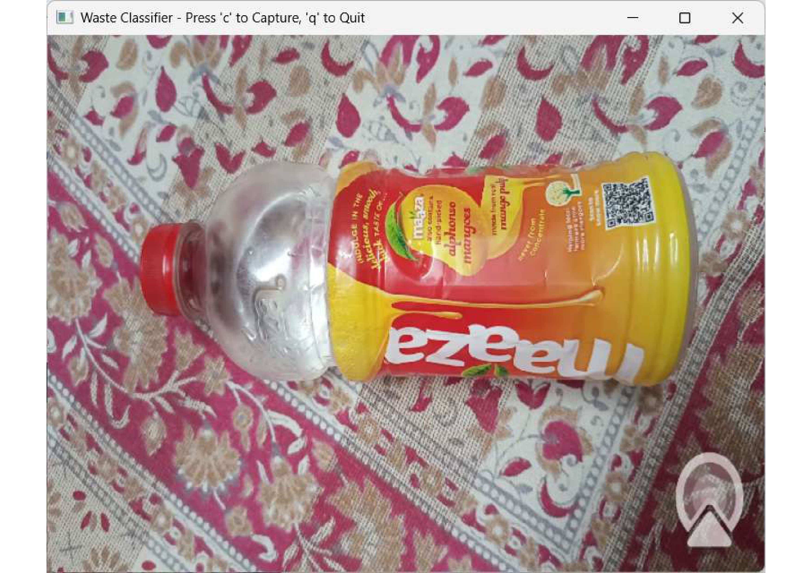
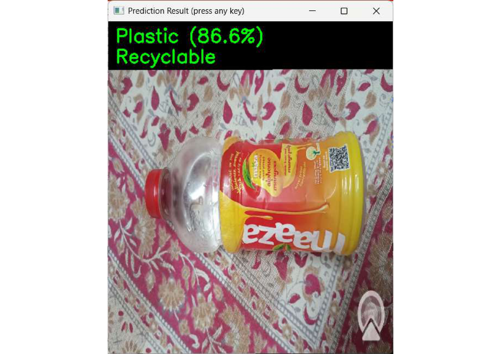
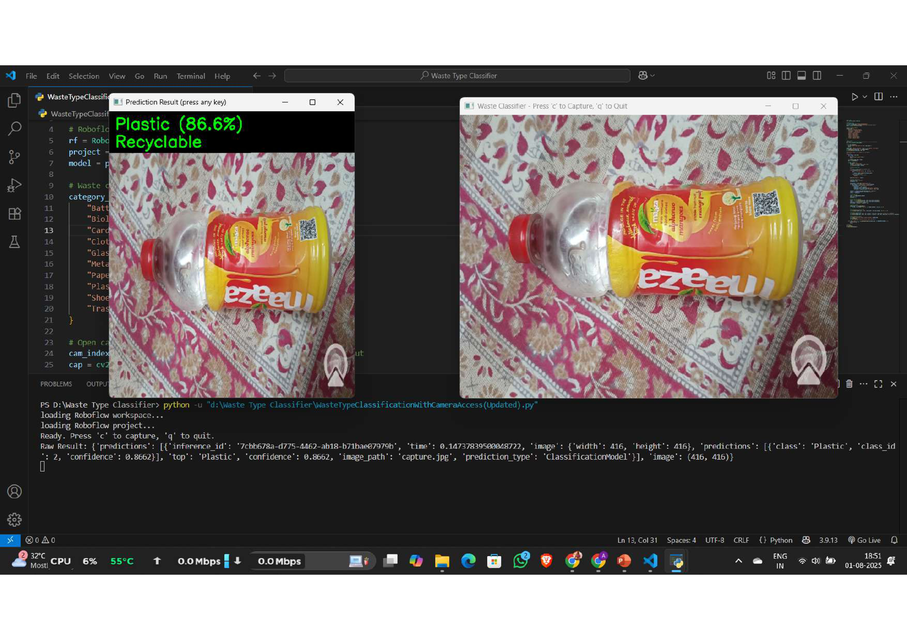
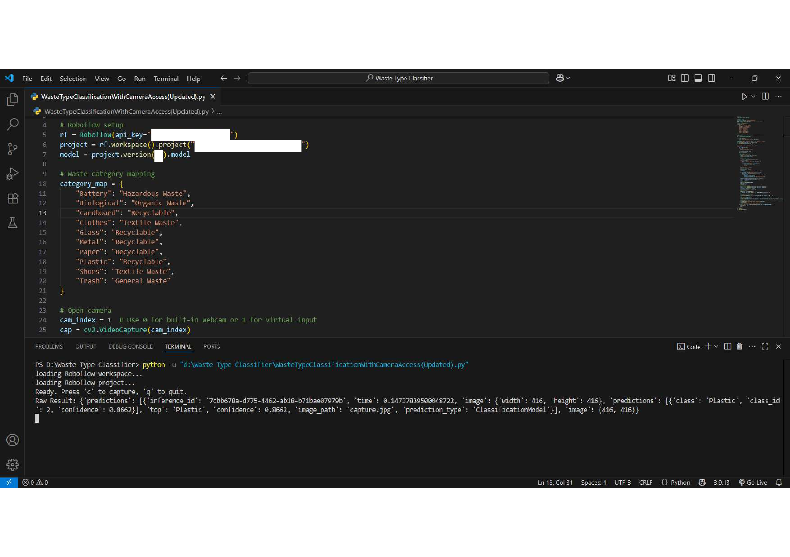
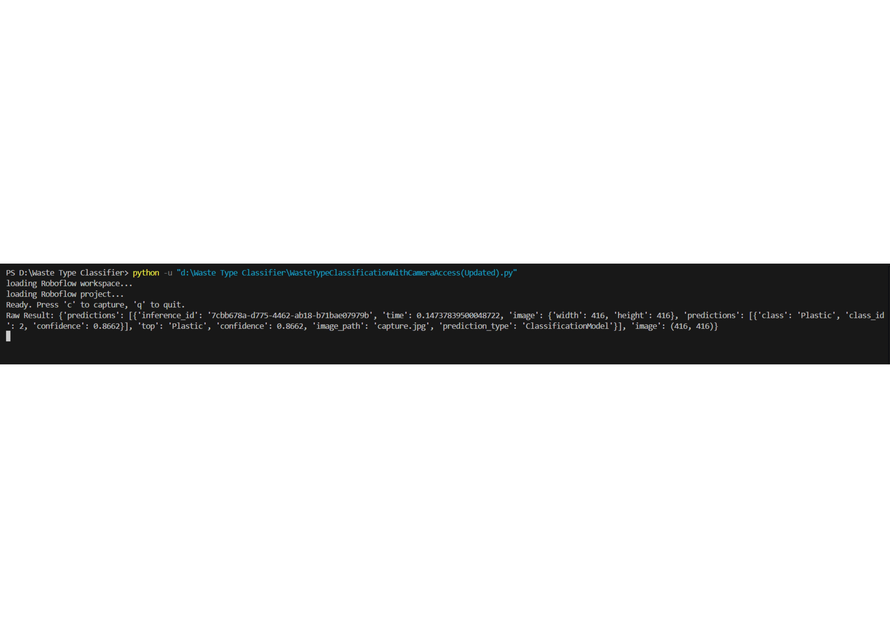

# Waste Type Classifier

A real-time waste classification system using computer vision and machine learning to identify and categorize different types of waste materials through camera input.

## Features

- Real-time waste classification through camera feed
- Supports multiple waste categories:
  - Hazardous Waste (Batteries)
  - Organic Waste (Biological)
  - Recyclable (Cardboard, Glass, Metal, Paper, Plastic)
  - Textile Waste (Clothes, Shoes)
  - General Waste (Trash)
- Live display of classification results with confidence scores
- User-friendly interface with keyboard controls

## Requirements

- Python 3.x
- OpenCV
- Roboflow

## Installation

1. Clone this repository
2. Install required packages:
```bash
pip install -r requirements.txt
```

3. Set up your Roboflow account and get your API key
4. Replace the placeholder API key in the code with your actual Roboflow API key
5. Update the project and model version according to your Roboflow setup

## Usage

1. Run the script:
```bash
python WasteTypeClassificationWithCameraAccess.py
```

2. Controls:
- Press 'c' to capture and classify an image
- Press 'q' to quit the application

## Sample Images

Here are some sample images from our test dataset:









## Configuration

You can modify the `category_map` dictionary in the code to customize waste categories according to your needs.

## Note

Make sure to set up your camera properly. The default camera index is 1 (for virtual input), change to 0 for built-in webcam or adjust according to your setup.
